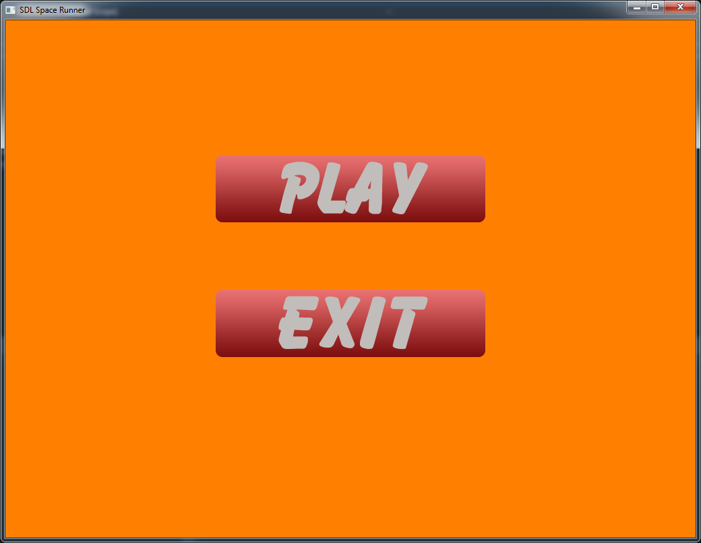
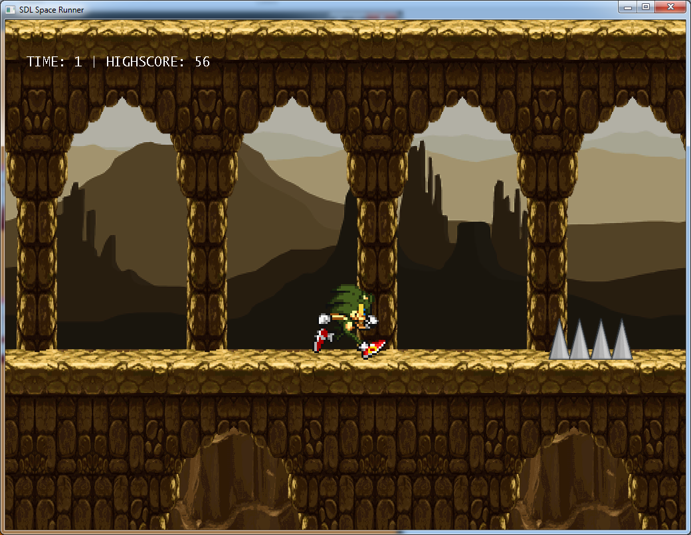
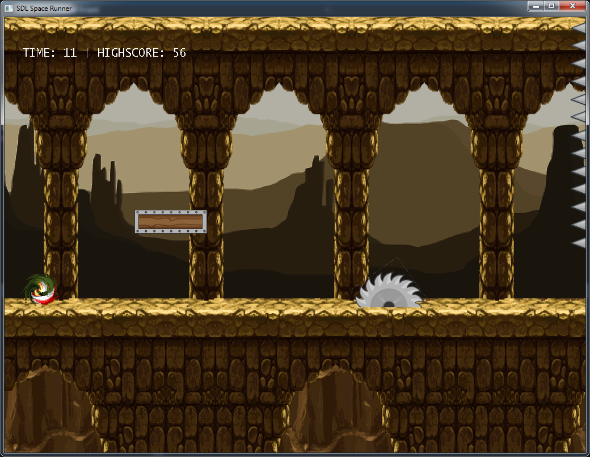
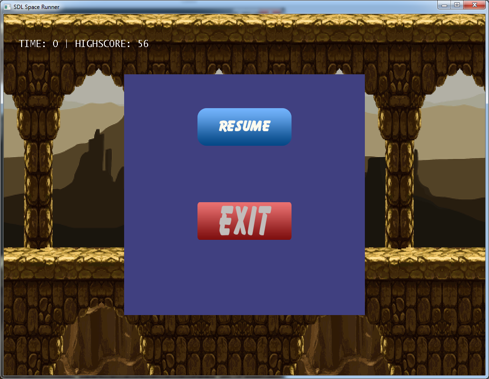
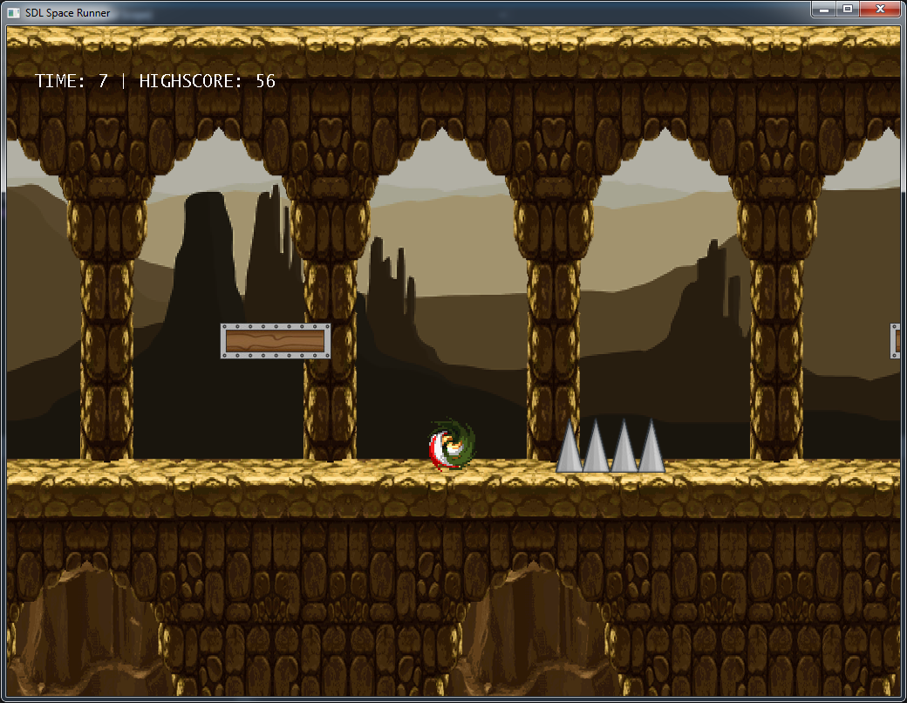
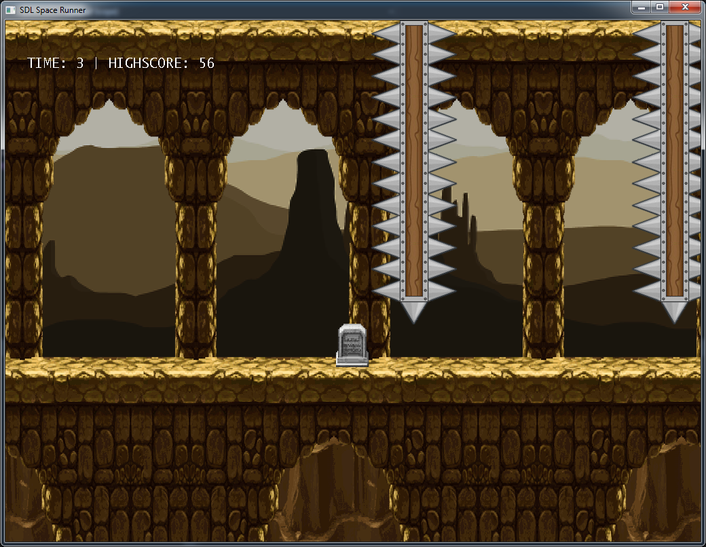
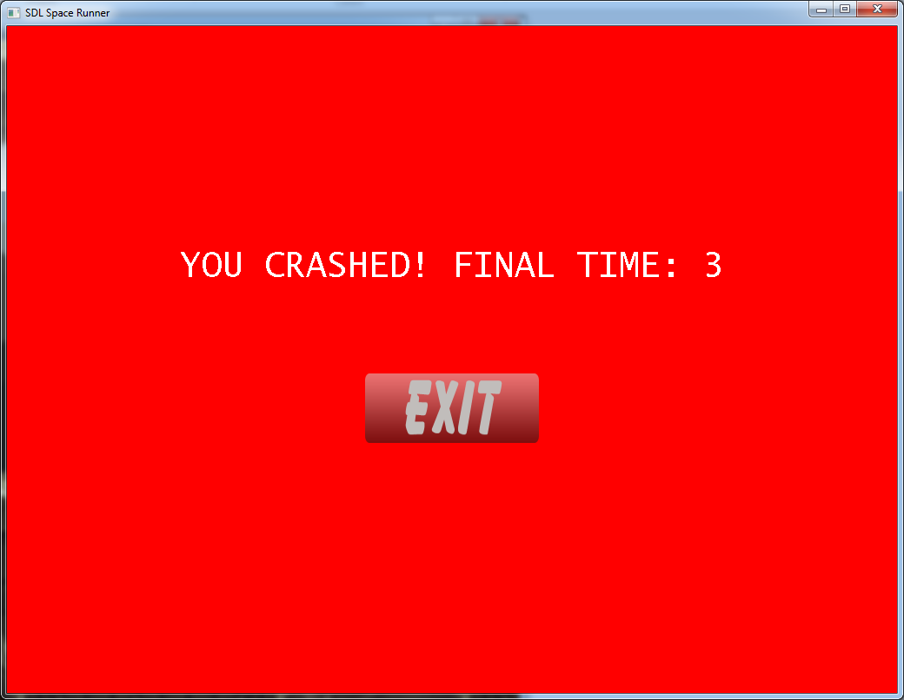

# SpaceRunner-2D-Sidescroller

### SpaceRunner is a 2D platformer/sidescroller game made using SDL. It utilises Finite State Machine to switch between game screens such as main menu, game play, pause screen, game end screen. Game structure includes AudioManager and ButtonManager to manage other aspects of the game such as buttons and background sound on main menu, end screen, pause screen. Game loop has been implemented using singleton. Game play includes crossing multiple obstacles which are randomly placed in the level. Player score is determined based on the total seconds player was alive in the game.

### Purpose of this project was to explore SDL further in-depth while also learning other libraries to handle text and sounds in the game. For example, jump sound, death sound, button select sound. The project also explored finite state machine to change between different states of the game as well as Audio and Button managers.

# Libraries
* SDL2 2.0.8
* SDL2_ttf 2.0.14
* SDL2_mixer 2.0.4
* SDL2_image 2.0.4

# Screenshots

### Main Menu

### Game Screen

### Game Screen 2

### Pause Screen

### Game Screen 3

### Game Screen 4

### Player Death

### End Screen

